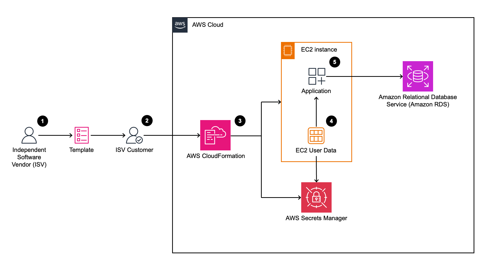

# Secure ISV Solution Deployment in Customer AWS Accounts

## Overview
Independent Software Vendors (ISVs) develop solutions for end customers which are sometimes launched in customer Amazon Web Services (AWS) accounts. Usually, the ISV will work with their customer to deploy the solution. However, in regulated industries, customer requirements may prevent the ISV from having any access to the customer environment, configuration information, and secrets.

This solution demonstrates a secure pattern for ISV (Independent Software Vendor) solutions to integrate with customer resources in AWS without requiring access to sensitive customer credentials. Using AWS CloudFormation, the customer can deploy the ISV's application while maintaining control over their credentials and resources. The solution leverages AWS Secrets Manager to securely store and retrieve database credentials, allowing the ISV application to connect to the customer's database without the ISV ever seeing the credentials.

The architecture diagram below shows how the solution works with the CloudFormation templates. Below the diagram is a numbered list corresponding to the diagram to explain the solution flow.

1. ISV develops technical solution which is run as an application on EC2.
2. Receiving a CloudFormation template, the customer deploys the solution and configures secrets and other parameters needed for integration with their existing resources in isolation from the ISV.
3. The deployed CloudFormation creates secrets in Secrets Manager and launches the EC2 instance.
4. Once the EC2 is launched, the user data accesses the values stored in Secrets Manager.
5. The application uses the secrets retrieved by the user data to securely access the customer's pre-existing resources. In this case, an Amazon RDS.

We assume the customer has an existing VPC with both public and private subnets.

## Prerequisites and limitations

### Prerequisites

* AWS Account
* Amazon VPC with at least one public and two private subnets
* Basic understanding of AWS CloudFormation, Amazon EC2, AWS IAM, AWS Secrets Manager, and Amazon RDS
* AWS IAM admin role or role which has full access to the listed services

### Limitations

* The demo solution is designed to be launched in us-east-1 (N. Virginia), us-east-2 (Ohio), us-west-1 (N. California), and us-west-2 (Oregon).

## Target technology stack

* AWS CloudFormation template
* AWS Secrets Manager secrets
* Amazon EC2 instance with application configured by userdata
* AWS IAM role for EC2 instance
* Amazon Relational Database Service (RDS)

## Repository Contents

The deployment is organized into three epics, each with detailed instructions:

- **Epic 1**: Set up the customer environment ([epic1.md](epic1.md))
  - Deploy a MySQL RDS database in private subnets
  - CloudFormation template: [epic1-rds.yaml](epic1-rds.yaml)

- **Epic 2**: Deploy the ISV solution ([epic2.md](epic2.md))
  - Deploy an EC2 instance with ISV application
  - Configure secure access to the customer's database
  - CloudFormation template: [epic2-ec2.yaml](epic2-ec2.yaml)

- **Epic 3**: Clean up resources ([epic3.md](epic3.md))
  - Instructions for removing all created resources

## Deployment Instructions

Follow the detailed instructions in each epic file:

1. First, follow [epic1.md](epic1.md) to set up the customer environment
2. Then, follow [epic2.md](epic2.md) to deploy the ISV solution
3. When finished, follow [epic3.md](epic3.md) to clean up all resources

## Security

This solution demonstrates several security best practices:

1. **Credential Isolation** - The ISV solution developers never directly handle database credentials
2. **Least Privilege Access** - IAM roles are configured with minimal permissions
3. **Secure Storage** - Sensitive information is stored in AWS Secrets Manager
4. **Runtime Secret Retrieval** - Credentials are retrieved at runtime, not stored in code
5. **Security Groups** - Traffic is restricted between components

## License

This library is licensed under the MIT-0 License. See the LICENSE file.
